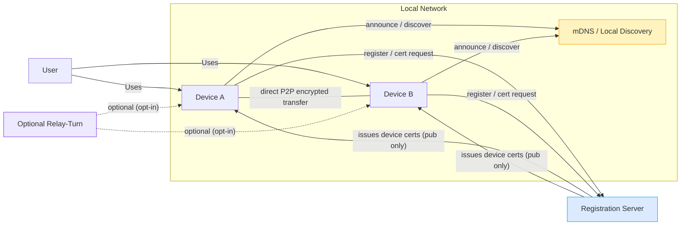

# ARCHITECTURE.md

> This file contains the canonical architecture description for **Open Share**. It includes high-level diagrams (Mermaid), component responsibilities, protocol details, data model, security considerations, deployment notes, and testing guidance. For sequence diagrams and full Mermaid flows, also see `docs/diagrams.md`.

---

## Table of contents

1. High-level overview
2. Architecture diagram (Mermaid)
3. Components & responsibilities
4. Discovery & pairing
5. Mutual authentication & handshake
6. Transport, transfer format & chunking
7. Data model & storage
8. Certificate lifecycle & revocation (CRL)
9. Security considerations (detailed)
10. Deployment & operations
11. Testing & validation
12. Glossary

---

## 1. High-level overview

Open Share is designed around a simple truth: when two devices are on the same local network, keep their file traffic local and encrypted. A minimal registration server is used to facilitate device management, bootstrap trust, and publish revocations when necessary.

Core properties:

* **LAN-first:** by default, clients prefer direct P2P on the LAN via QUIC/TCP.
* **Minimal server footprint:** server stores public keys, metadata and CRL only.
* **Modular client:** Rust core handles discovery, crypto, transport and storage; GUI or CLI are thin layers.
* **Robust fallback modes:** QR/manual pairing and optional relay for NAT-traversal or cross-network transfers.

---

## 2. Architecture diagram (Mermaid)

Paste this into any Mermaid renderer (or `docs/diagrams.md`) to visualize the system.

**Interpretation**

* Devices A and B prefer to connect directly if they detect each other via local discovery. The registration server is used to issue **public** device certificates and supply a trust root and CRL.
* Relay is optional and used only when users explicitly enable remote routing; it is not on by default.

---

## 3. Components & responsibilities

### Client (Rust core)

* **Discovery module**: mDNS TXT broadcasting; supports UDP broadcast as fallback. Announces a compact TXT payload: `{acct_hash, dev_id, fp, port}`. Listens and filters results by `acct_hash`.
* **Key management**: generate Ed25519 identity keypair; store private key in secure enclave or OS keystore. Provide an API for ephemeral X25519 keys for handshake.
* **Crypto layer**: Ed25519 for identity signatures, X25519 for ephemeral ECDH, HKDF-SHA256 for session key derivation, ChaCha20-Poly1305 / AES-GCM for AEAD.
* **Transport**: primary QUIC for low-latency streams and multipath advantage. Fallback to TLS over TCP where QUIC is unavailable.
* **Storage layer**: local block store for chunk cache and manifests; manifest contains metadata and chunk hashes to enable dedup and resume.
* **Pairing layer**: QR and manual codes for offline pairing; one-time tokens signed by a registered device.
* **UI/CLI**: thin layer to present devices, fingerprints, and transfer status. Must show clear warnings for unknown devices.

### Server (Django)

* **Auth & accounts**: typical Django auth for user accounts; API endpoints protected via tokens or session.
* **Device registry**: endpoint `/device/register` to accept device pubkey and metadata. Server returns a compact `cert_blob` signed by server signing key.
* **CRL management**: admin endpoints to revoke devices; server exposes `GET /crl` for clients to fetch revocations.
* **Trust root**: `GET /trustroot` returns signing public key to verify server signatures. Rotate keys via well-documented ops flows.
* **Audit logs**: sign and store issuance and revocation events for compliance.

### Optional Relay / TURN

* Implemented as a stateless relay that forwards encrypted AEAD chunks. It cannot decrypt payloads; acts only as a TCP/UDP tunnel.
* Relay must be opt-in and clearly shown to users as "relay-enabled" with a privacy notice.

### Ops & Security

* Use KMS/HSM for the server signing key; restrict access to a small ops team.
* Monitoring for cert issuance, CRL updates, and relay usage.

---

## 4. Discovery & pairing

### mDNS discovery

* Devices broadcast a small TXT record with `acct_hash`, `dev_id`, `fp` (short fingerprint), and `port` for connection.
* Devices that see other devices verify `acct_hash` locally and show candidate devices in UI.
* Discovery latency goal: <3 seconds on well-behaved LANs.

### Broadcast fallback

* When multicast is blocked (some enterprise networks) use UDP broadcast as a fallback where supported.

### Offline pairing (QR / TOFU)

* Registered device can generate a one-time signed pairing token:

  * `T = Sign_Reg({nonce, timestamp, new_pubkey, ttl})`
  * Show `T` as a QR code. New device scans it and verifies the signature with server `trustroot` or cached cert.
  * New device establishes a provisional trust; later when online it should upload its pubkey to the server for a fully signed cert.

### Pairing UX rules

* Show full device fingerprint for manual confirmation.
* Allow short-lived provisional trust vs permanent trust choices in UI.

---

## 5. Mutual authentication & handshake

This is the canonical handshake used to derive a session key and prove identities.

### Steps (summary)

1. Devices exchange `device_cert_A` and `device_cert_B` (signed by server). Validate server signature and expiry; check CRL.
2. Each side generates ephemeral X25519 keypair `xA`, `xB`.
3. A sends `xA_pub` + `Sign_A(xA_pub || nonceA)` where `Sign_A` uses the device Ed25519 key.
4. B sends `xB_pub` + `Sign_B(xB_pub || nonceB)`.
5. Each side computes `shared = X25519(xA_priv, xB_pub)`.
6. Derive `session_key = HKDF(shared || certA || certB || nonceA || nonceB)`.
7. Establish AEAD channel (ChaCha20-Poly1305 / AES-GCM) for subsequent chunk transfers.

**Why sign ephemeral pubkeys?**

* Prevents MitM even if local discovery spoofing occurs.
* Binds ephemeral keys to device identity proving possession of the identity private key.

**CRL checks**

* Devices must check cert expiry and consult cached CRL. If online, fetch the latest CRL before accepting new handshakes when possible.

---

## 6. Transport, transfer format & chunking

### Transport

* Primary: QUIC — supports multiplexing, fast connection establishment, improved NAT traversal.
* Fallback: TLS over TCP if QUIC unavailable.
* For mobile platforms, adapt to platform-specific networking constraints (Android Doze, iOS background limits).

### Manifest-driven transfer

* Sender creates a `manifest` describing file metadata and ordered `chunk_hashes[]`.
* Manifest is signed by the sender's identity key.
* Receiver verifies manifest signature and checks which chunk hashes it already has cached.
* Receiver requests missing chunk IDs; sender streams encrypted chunks.

### Chunking rules

* Chunk size: default 256KiB — tuneable for network and memory constraints.
* Use content-addressed chunk ids: `chunk_id = SHA256(chunk_bytes)`.
* Allow variable chunk sizes for large-file optimization (e.g., larger chunk size for >1GiB files).
* Store chunk metadata and references in manifest for later dedup.

### Resumption

* If connection drops, use manifest and chunk status to resume from last acknowledged chunk.
* Keep a small in-memory and on-disk state for active transfers to reduce revalidation time.

### Integrity

* Per-chunk SHA-256 for integrity; final file hash validated against manifest.

---

## 7. Data model & storage

Detailed diagrams live in `ARCHITECTURE.md` and `docs/diagrams.md` — this is a concise description.

**Entities**

* `User`:

  * `user_id`, `email_hash`, `pw_hash` (if stored), `created_at`.
* `Device`:

  * `device_id`, `account_id`, `pubkey_ed25519`, `cert_blob`, `revoked` flag, `last_seen`.
* `FileManifest`:

  * `manifest_id`, `filename`, `size`, `chunk_hashes[]`, `sender_sig`.
* `Chunk` (client-side cache):

  * `chunk_id`, `size`, `bytes` or pointer to file, `last_used`
* `CRL`:

  * list of `revoked_device_ids`, `issued_at`.

**Server storage**

* Only stores: `Device` entries (public info), `CRL`, issuance & revocation logs, minimal account metadata.
* No file payloads recorded.

**Client storage**

* Local block store for chunk cache and manifests (for resume/dedupe).
* Optionally encrypted on-disk store if local privacy mandates.

---

## 8. Certificate lifecycle & revocation (CRL)

### Certificate issuance

* When a new device registers, it generates an Ed25519 keypair locally and submits the public key to `/device/register` with metadata.
* Server signs a compact cert containing `{device_id, account_id, pubkey, issued_at, expires_at}` and returns `cert_blob`.

### Recommended cert lifetime

* Short-lived certs are preferable — e.g., 6-12 months for device certs with more frequent rotation for high-security environments.

### Revocation

* Admin triggers `/device/revoke` → server adds `device_id` to CRL with `issued_at` timestamp.
* Devices fetch `GET /crl` on a schedule or when performing critical operations; they should cache CRL and verify against it during handshake.
* CRL format should be compact and verifiable (signed by server trust key or HMAC) to avoid tampering.

### CRL propagation strategies

* Pull model: clients poll `GET /crl` every `N` minutes (tradeoff: staleness vs. load).
* Push model: server can push via long-poll websockets or SSE to connected clients where feasible.
* Hybrid: server publishes CRL to CDN or object storage and increments a small `crl_version` integer clients check.

---

## 9. Security considerations (detailed)

### Threat model (brief)

* Local network attackers who can sniff or inject mDNS/broadcast.
* Rogue device that attempts to impersonate a device.
* Server compromise that yields signing key (mitigated by HSM/KMS and rotation policy).
* Relay operator — must be treated as untrusted for confidentiality.

### Defenses

* **Signed ephemeral keys:** prevents MitM even if discovery is spoofed.
* **CRL & short certs:** limit blast radius of compromised or lost devices.
* **Secure enclaves for private keys:** reduce key-exfiltration risk on client devices.
* **Audit logs & monitoring:** detect abnormal certificate issuance or revocations.
* **Telemetry & rate-limiting:** throttle registration and pairing attempts to prevent brute-force or spam.

### Privacy

* Server stores only public metadata; file payloads do not transit the server unless explicitly sent through a relay by user choice.
* Relay should be audited and disclosed to users when used.

### Hardening recommendations

* Use secure defaults for TLS (disable old ciphers, enable HSTS on web endpoints).
* Require server-side admin approvals for high-risk actions (mass revocation).
* Add optional hardware attestation for devices that support TPM/SE attestation for stronger identity guarantees.

---

## 10. Deployment & operations

### Server deployment

* Containerize Django app; use Gunicorn behind Nginx for TLS termination or put behind a managed load balancer.
* Use environment-based settings: `development`, `staging`, `production`.
* Store signing keys in KMS/HSM and only expose signing ability via a secure, audited API.
* Backup & retention: keep issuance and revocation logs in an append-only store (e.g., write-once S3 bucket with restricted access).

### Scaling

* Device registry scales easily since device entries are small; use DB sharding or read-replicas for very large deployments.
* CRL publication scales by using object storage or CDN; clients fetch a compact CRL blob.
* Relay components may need autoscaling — treat them stateless and horizontally scalable.

### Monitoring

Track metrics such as:

* Device registrations per minute.
* CRL version and fetch success rates.
* Relay bandwidth usage (if relay used).
* Handshake success/failure rates.

---

## 11. Testing & validation

### Unit tests

* Crypto primitives (signing, verification), KDF derivation tests, manifest verification.

### Integration tests

* Emulate local network discovery; validate handshake flows across simulated networks.
* Transfer tests across lossy links and resume scenarios.

### Network tests

* Multicast blocked networks.
* Client isolation (enterprise guest networks).
* Mobile hotspots and NAT types.

### Security tests

* CRL enforcement tests (revoked device is refused).
* Replay attacks on ephemeral keys.
* mDNS spoofing attempts and mitigation validation.

---

## 12. Glossary

* **AEAD:** Authenticated Encryption with Associated Data.
* **CRL:** Certificate Revocation List.
* **Ed25519:** Signature scheme for device identity.
* **X25519:** ECDH curve for ephemeral key agreement.
* **TOFU:** Trust On First Use.
* **mDNS:** multicast DNS for local discovery.

---
