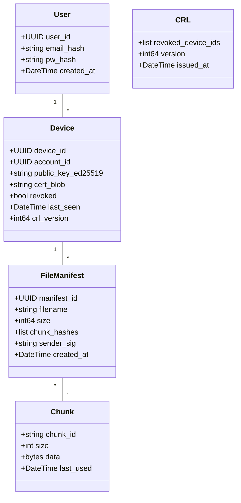

# Data Model (Class Diagram) — Open Share


This file contains the enhanced data model (class diagram) for Open Share with field-level explanations, indexing suggestions, and migration notes for the Django server.

---

## Diagram 



---

## Field explanations & indexing

### User

* `user_id` (UUID): primary key, immutable.
* `email_hash`: SHA256(email) or bcrypt variant depending on privacy needs. Use `email_hash` instead of plain email in discovery contexts.
* `pw_hash`: if storing passwords, use strong hashing (Argon2id) and never store plaintext.
* Index: `email_hash` (unique).

### Device

* `device_id` (UUID): primary key for devices.
* `account_id`: foreign key to `User.user_id`.
* `public_key_ed25519`: base64-encoded public key.
* `cert_blob`: JSON returned by server signing operation; store as text to preserve signature bytes.
* `revoked` (bool): quick local check; authoritative revocation via CRL.
* `last_seen`: helpful for housekeeping (e.g., device cleanup after prolonged inactivity).
* `crl_version`: track the version at which the server added this device (helps in audits and delta CRL generation).
* Index: `(account_id, device_id)` for quick lookups.

### FileManifest

* `manifest_id` (UUID): PK for manifest.
* `chunk_hashes`: an ordered array of SHA256 chunk ids.
* `sender_sig`: signature by sender's Ed25519 key over canonical manifest representation.
* Index: `manifest_id`, `filename` (optional), `created_at` for retention policies.

### Chunk

* `chunk_id`: content-addressed id (e.g., `sha256:...`).
* `data`: stored locally on the client only; server does not persist unless a relay option is used.
* `last_used`: allows cache eviction policies like LRU.
* Consider storing metadata (refcount) for dedup across multiple manifests.

### CRL

* `revoked_device_ids`: array (or separate normalized table of `crl_entries` for large fleets).
* `version`: incremented integer; clients use this to check freshness.
* `issued_at`: timestamp for staleness detection.

---

## Django migration & schema notes

* Use Django `UUIDField` for primary keys where appropriate.
* For `chunk` storage, prefer local filesystem storage with path references in DB via `FileField` or a small embedded local object store.
* For CRL, if fleet is small, store as JSON blob; for large scale, normalize CRL entries into a separate table with `device_id` and `revoked_at` fields and expose deltas (e.g., `crl_since_version`).

---

## Retention & cleanup policies

* Device inactivity cleanup: soft-delete devices not seen for X months; keep log entries for audit.
* Chunk eviction: LRU or time-based TTL for chunk caches. Provide user settings to configure cache size.
* Manifest retention: retain for a short window (e.g., 30 days) to support resume; after that, remove manifests unless user opts-in for extended history.

---

## Example SQL for CRL delta (normalized table)

```sql
CREATE TABLE crl_entries (
  id SERIAL PRIMARY KEY,
  device_id UUID NOT NULL,
  revoked_at TIMESTAMP WITH TIME ZONE DEFAULT NOW()
);

-- Query to get entries since a version timestamp
SELECT device_id FROM crl_entries WHERE revoked_at > :last_seen_timestamp;
```

---

## GDPR & privacy considerations

* Avoid storing email plaintext; use `email_hash` when needed for discovery.
* Allow users to request account/device deletion; implement workflow to revoke devices and purge device rows while retaining minimal audit logs (redacted) for compliance if required.

---

