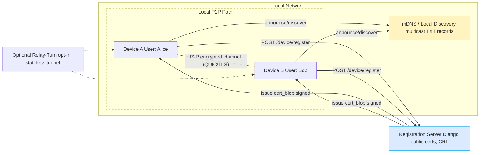

# High-level Architecture — Open Share

This page contains a focused, enhanced high-level architecture diagram for **Open Share** and a detailed narrative explaining components, trust boundaries, data flow, and operational considerations. Paste the Mermaid block into a Markdown file or a Mermaid live editor to render the diagram.

---

## Diagram 

---

## Narrative & deeper explanation

### 1) Purpose of this diagram

This high-level diagram is aimed at product managers, architects and new developers joining the project. It clarifies the *trust boundaries* (what is trusted, what is not), the *default data path* for file payloads, and optional components (relay). Keep in mind the guiding principle: **keep file payloads local by default**.

### 2) Trust boundaries and data responsibilities

* **Client devices (Device A / B)** hold private identity keys — these are never shared.
* **Registration Server (Django)** holds only server signing key (in production: in KMS/HSM), public device metadata, and the CRL. It cannot decrypt file payloads because it never has private device keys.
* **Relay** acts purely as a packet forwarder for encrypted chunks; it is an untrusted component with respect to confidentiality. Relay operators should be auditable and the UI must declare when a transfer uses a relay.

### 3) Data flow lifecycle (fast path)

1. Device generates Ed25519 identity key locally.
2. Device registers the public key with the Registration Server (POST /device/register) and receives a signed `cert_blob` with device metadata and expiry.
3. Devices announce presence on LAN via mDNS TXT records (compact account-hash + device id + port + short fingerprint).
4. When peer discovered, devices connect directly (QUIC preferred) and perform mutual authentication, deriving ephemeral session keys.
5. File manifests and encrypted chunks flow directly A ↔ B over LAN.

### 4) Relay & opt-in semantics

* Relay is used only when direct connection fails (NATs, firewall) **and the user explicitly opts in** to route via relay.
* Relay must implement minimal logging and rate-limiting and must never attempt to decrypt payloads.

### 5) Operational considerations

* **CRL freshness:** Clients should fetch CRL periodically (e.g., every 5–30 minutes depending on threat tolerance) and cache it; the UI must show when CRL is stale.
* **Discovery privacy:** TXT announcements contain `acct_hash` rather than plaintext emails to avoid leaking user identifiers on the LAN.
* **Device provisioning UX:** In networks where mDNS is blocked, provide a simple fallback (QR pairing) and a clear security explanation in the UI.

### 6) Enhancements & implementation tips

* In the mDNS TXT payload include a small TTL and version number (e.g., `{v:1, acct_hash:XXX, dev:dev-01, p:12345, f:abcd}`) so future changes are backward compatible.
* When using QUIC, prefer shorter connection lifetimes per transfer and only hold long-lived connections for background sync/cache invalidation.
* Consider circuit-breaker logic when a peer repeatedly fails handshake — temporarily avoid attempting direct connections and suggest QR pairing.

---

## Edge cases & troubleshooting

* **Multicast completely blocked**: discovery fails; fallback to broadcast or QR manual pairing.
* **Different subnets with no relay**: user must opt-in to relay or use manual relay configuration.
* **CRL unavailable**: clients should refuse to accept new handshakes if CRL is older than a configured threshold in high-security deployments (configurable policy).

---

## Rendering tips

* This diagram is intentionally styled with classDefs to make the server and mDNS visually distinct. When you paste into `docs/diagrams.md` or into GitHub, the Mermaid renderer will honor these styles (supported in most modern Mermaid renderers).

---

