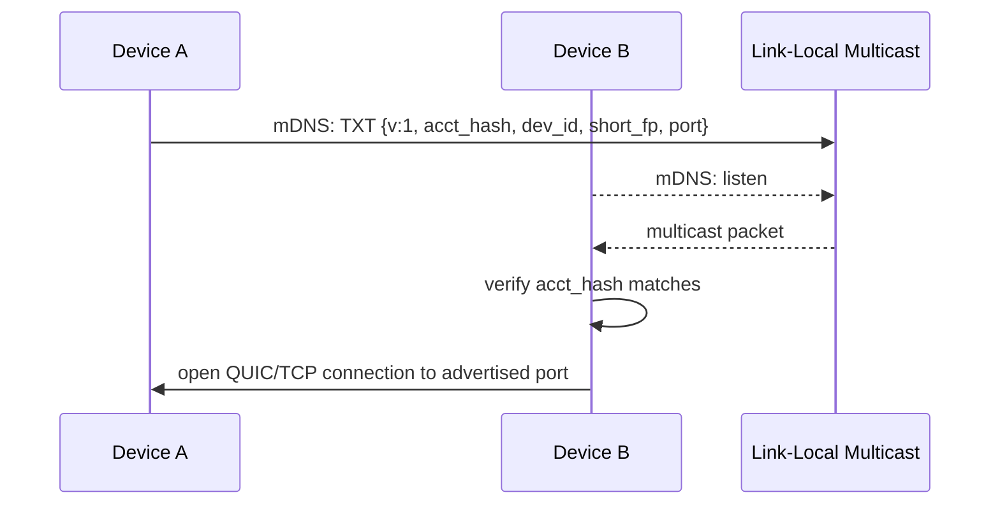
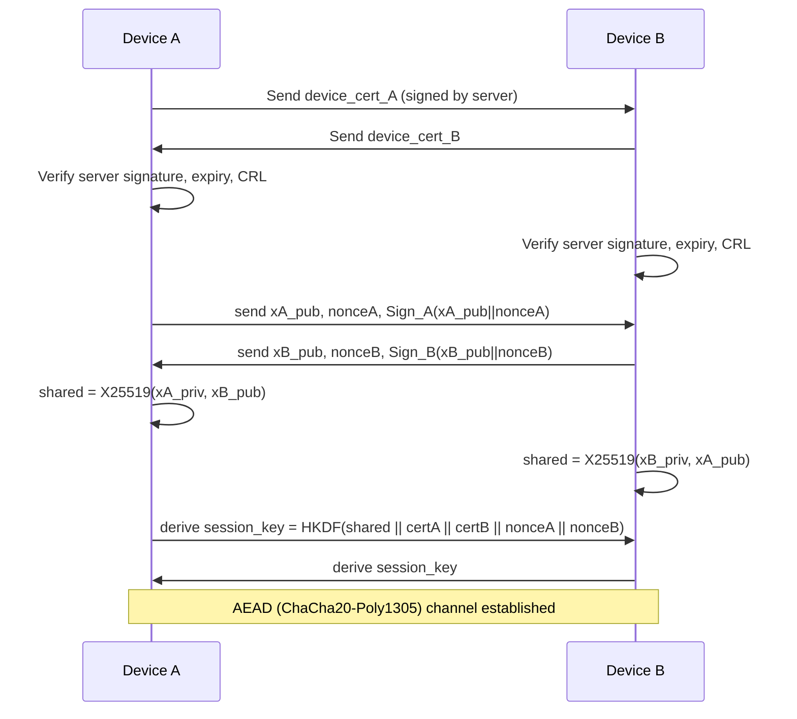
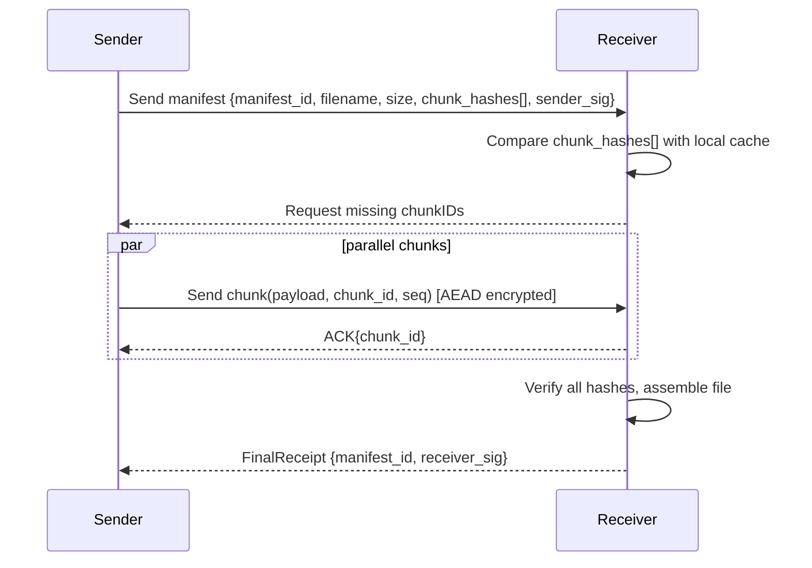
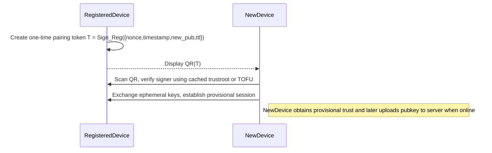
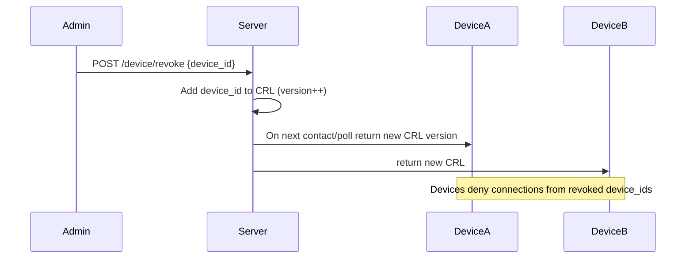

# Sequence Diagrams — Open Share


This document contains enhanced, highly-detailed sequence diagrams for the critical Open Share flows: Registration, Discovery, Mutual Handshake, File Transfer, Offline Pairing (QR), and Revocation (CRL propagation). Each section includes step-by-step explanations, data formats, security checks, timing expectations and failure handling.

---

## 1) Registration 

```mermaid
sequenceDiagram
  participant U as User
  participant D as Device
  participant S as RegistrationServer

  U->>D: Launch registration flow (UI)
  D->>D: Generate Ed25519 keypair (identity)
  D->>S: POST /v1/device/register {
    device_id, account_id, pubkey_ed25519, metadata
  }
  S-->>D: 201 Created { cert_blob }
  D->>D: Store private key in secure store; cache cert & trustroot
  Note right of D: Device ready. Cert expiry set (e.g. 12 months)
```

**Details & checks**

* The client must generate a high-entropy Ed25519 key pair using a vetted library.
* POST must happen over TLS and be authenticated with the user session or a one-time registration token.
* Server signs `cert_blob` with server signing key held in KMS/HSM. The `cert_blob` contains minimal fields and `sig`.

**Failure handling**

* If `POST` fails due to network, client should retry with exponential backoff and persist ephemeral state locally.
* If server rejects due to quota or invalid token, surface explicit UI error and stop.

---

## 2) Discovery (mDNS / UDP broadcast)



**Timing & expectations**

* mDNS announcements should repeat every 1–3s for the first 30s, then back off when on steady state to reduce noise.
* UI should indicate discovery latency and present a filtered list by `acct_hash`.

**Edge cases**

* If multicast is blocked, attempt UDP broadcast then fallback to QR pairing.
* If multiple devices announce same `dev_id`, warn user and refuse connections until resolved.

---

## 3) Mutual authentication handshake 



**Why signed ephemeral keys?**

* This binds ephemeral ECDH to the device's long-term identity; prevents MitM.

**Verification steps**

1. Verify `device_cert_*` signature using `trustroot`.
2. Ensure `expires_at` not passed.
3. Confirm `device_id` not in local CRL cache.
4. Validate signature on signed ephemeral pubkey using device Ed25519 pubkey.

**Nonce selection**

* Use 96-bit or larger nonces from a secure RNG. Include nonces in HKDF to prevent key reuse.

---

## 4) File transfer (manifest + chunking) — robust flow



**Manifest format (example)**

```json
{
  "manifest_id":"m-123",
  "filename":"report.pdf",
  "size":104857600,
  "chunk_hashes":["sha256:aaa...","sha256:bbb..."],
  "sender_sig":"BASE64_SIG"
}
```

**Transfer optimizations**

* Parallel chunk streaming over multiple QUIC streams for high throughput.
* Use per-chunk ACKs to cheaply resume and ensure ordered assembly.
* Use a small sliding window to avoid head-of-line blocking.

**Resume logic**

* On reconnect, receiver re-sends list of missing chunk IDs.
* Sender re-streams only missing chunks.

---

## 5) Offline pairing (QR handoff)



**Security notes**

* QR token contains an expiry (TTL) and one-time nonce; scanning after TTL should be rejected.
* Provisional trust is not equivalent to server-signed certs; warn user in UI until the server signs the new device.

---

## 6) Revocation (CRL propagation)



**CRL details**

* CRL must be verifiable: sign it with server key or host via authenticated endpoint.
* Include `crl_version` and `issued_at` so clients can quickly see freshness.
* Consider incremental CRL deltas for very large fleets.

---

## Rendering & best practices

* Keep sequence diagrams focused: show real payload examples in notes beside the diagram.
* Use the `note` directive in Mermaid to display short payload snippets or security checks.

---

